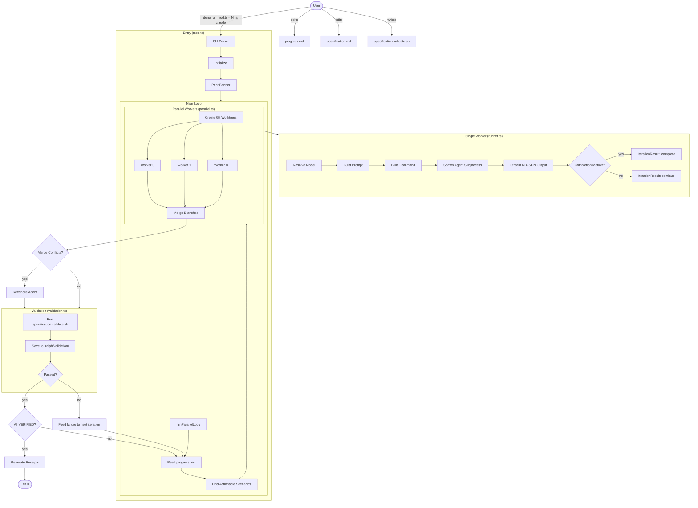
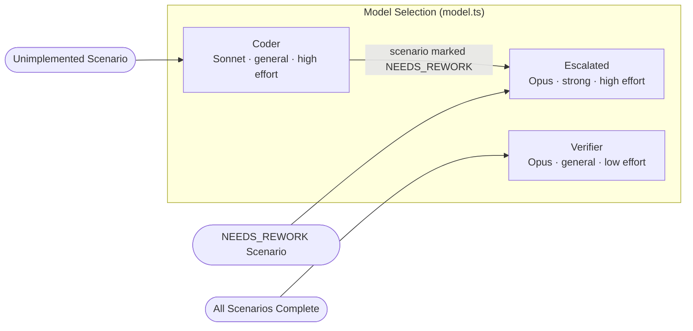
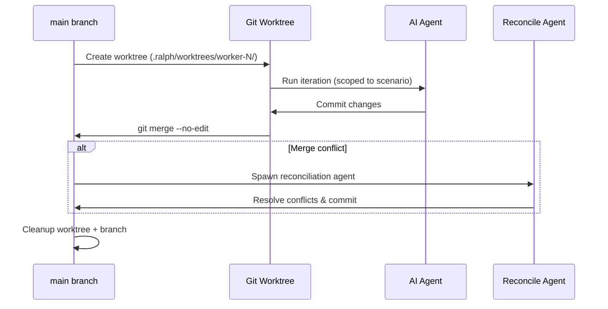
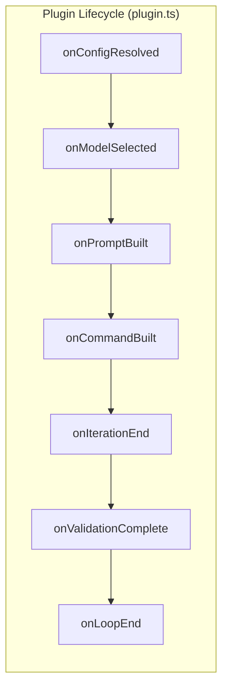
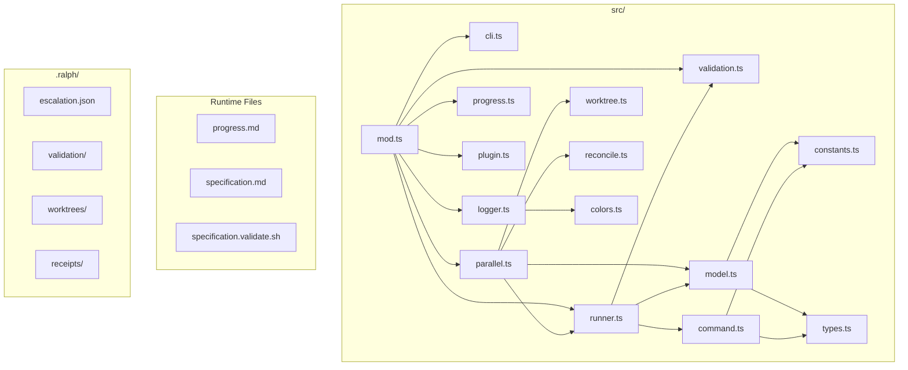

# Ralphmania Architecture

> AI agent orchestrator that iteratively implements a specification via parallel
> workers, validation, and escalation.

## System Overview



## Model Escalation Ladder



## Worker Isolation & Merge



## Plugin Hooks



## File Map



## Key Data Flow

```
specification.md ──→ prompt ──→ agent ──→ code changes ──→ git commit
                                                              │
progress.md ◄──────────────────────────────────────── agent updates status
                                                              │
specification.validate.sh ◄──────────── runs after merge ────┘
         │
         └──→ .ralph/validation/iteration-N.log ──→ feeds next iteration
```

## Scenario Lifecycle

```
UNIMPLEMENTED ──→ COMPLETE ──→ VERIFIED
       ▲              │
       │              ▼
       └──── NEEDS_REWORK
              (user marks)
```
