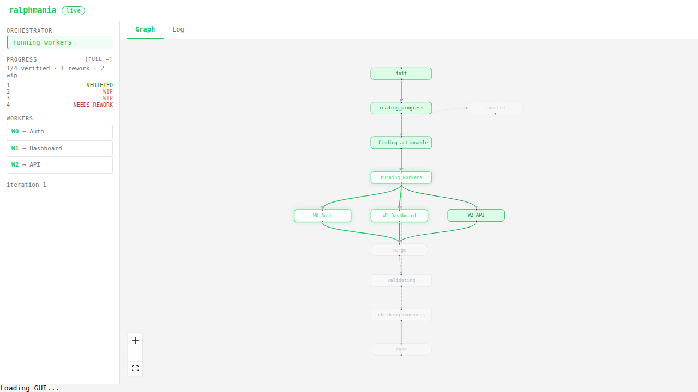

# ralphmania

Run an AI agent in a loop until a specification is complete. Essentially, tell
`ralphmania`, "Here are my goals, do work until everything is done and
verified."

```bash
deno run -A jsr:@cdaringe/ralphmania -i 10
deno run -A jsr:@cdaringe/ralphmania -i 10 [-a claude|codex]
deno run -A jsr:@cdaringe/ralphmania -i 10 --plugin ./my-plugin.ts
deno run -A jsr:@cdaringe/ralphmania -i 10 --gui
deno run -A jsr:@cdaringe/ralphmania -i 10 --sim
deno run -A jsr:@cdaringe/ralphmania serve receipts [--open] [--port 8421]
```

- ✅ Good for projects where the specifications are evolving or not fully baked.
- ❌ Bad for projects with firm or static specifications.

<details>
<summary>What makes `ralphmania` different from naive-ralphing?</summary>

A basic "ralph loop" is great for one shot development. However, `ralphmania` is
designed for iterative development. Specifically, it has strong support for:

1. **REWORK** - letting the user update the the task tracking document
   (progress.md) if a specification has been refined or has not implemented per
   expectation.
2. **VERIFICATION** - a step that analyzes the intent of the coding work against
   the actual output. Can be skipped.
3. **VALIDATION** - a user-defined validation hook that can be as simple or
   complex as needed, with support for test scripts, static analysis, or manual
   review. Validation results are fed back into the loop to guide rework or
   escalation decisions.
4. **ESCALATION** - automatically switching to a stronger model when rework is
   detected, but scoping that escalation to just the failing scenarios to save
   on tokens and cost.
5. **PLUGINS** - support for changing the default flow if you want to tune
   default behaviors!

</details>

## Live GUI

Pass `--gui` to launch a real-time web dashboard alongside the orchestrator:

```bash
deno run -A jsr:@cdaringe/ralphmania -i 10 --gui
```



The GUI shows an interactive workflow graph, per-worker log streaming, scenario
status editing, and agent input -- all updated in real-time via SSE.

## Simulation Mode

Pass `--sim` to run the GUI with simulated agent backends -- no real agents, git
operations, or filesystem side effects:

```bash
deno run -A jsr:@cdaringe/ralphmania -i 10 --sim
deno run -A jsr:@cdaringe/ralphmania -i 10 --sim --sim-scenarios 8 --sim-profile realistic
```

| Flag              | Default | Description                                       |
| ----------------- | ------- | ------------------------------------------------- |
| `--sim`           | `false` | Enable simulation mode (implies `--gui`)          |
| `--sim-scenarios` | `4`     | Number of simulated scenarios                     |
| `--sim-profile`   | `fast`  | Timing profile: `instant`, `fast`, or `realistic` |

A **dev panel** appears in the bottom-right corner of the GUI with controls for:

- **Timing profile** -- how fast simulated operations complete
- **Auto-advance** -- toggle automatic progression; when off, step through
  transitions manually
- **Validation failure rate** -- probability of validation failing after merge
- **Merge conflict rate** -- probability of a simulated merge conflict
- **Worker failure rate** -- probability of a worker timing out
- **Per-scenario outcomes** -- set each scenario to complete, needs_rework, or
  timeout

The real orchestrator state machine runs unmodified -- only the `MachineDeps`
adapter is swapped for an in-memory simulation. The GUI receives the exact same
event stream as in production, making this ideal for developing and testing the
UI.

For programmatic use in browser tests, create a `SimController` directly:

```typescript
import { createSimController } from "jsr:@cdaringe/ralphmania/sim/controller";
import { createSimDeps } from "jsr:@cdaringe/ralphmania/sim/deps";
```

## How it works

1. Write a `specification.md` with scenarios
2. Run ralphmania -- it iterates an AI agent, tracking progress in `progress.md`
3. Each iteration is validated via `specification.validate.sh` (user tunable,
   created on first run)
4. Review `progress.md` between runs -- mark scenarios as `VERIFIED` or
   `NEEDS_REWORK` to request fixes
5. When rework is detected, ralphmania escalates to stronger models, scoped to
   failing scenarios

## Example

**specification.md:**

Write a specification document _like_ the following:

```md
## Scenarios

| # | Scenario  | Description                                    |
| - | --------- | ---------------------------------------------- |
| 1 | Auth      | The system SHALL support login/logout with JWT |
| 2 | Dashboard | The GUI SHALL support user stats on /dashboard |
```

Append only into your specification. Your scenarios IDs can be anything--not
just numbers. For example `GUI.1`, `GUI.1a`, `DASH.x`, etc--not just integers.

**progress.md** (managed by the agent, editable by you):

```md
| # | Status       | Summary                     | Rework notes         |
| - | ------------ | --------------------------- | -------------------- |
| 1 | VERIFIED     | docs/scenarios/auth.md      |                      |
| 2 | NEEDS_REWORK | docs/scenarios/dashboard.md | missing error states |
```

- Set a status to `NEEDS_REWORK` with notes and ralphmania will direct the agent
  to fix it, escalating to a stronger model if rework persists. The agent
  verification step will do this sometimes, or you the user may do this at the
  end of an iteration cycle!
- Set a status to `OBSOLETE` if you no longer need that scenario.

## Plugins

Extend the loop by exporting a `plugin` object with optional hooks:

```typescript
import type { Plugin } from "jsr:@cdaringe/ralphmania";

export const plugin: Plugin = {
  onPromptBuilt({ prompt }) {
    return prompt + "\nAlways use TypeScript.";
  },
};
```

Load via `--plugin ./my-plugin.ts`. All hooks receive a `HookContext`
(`{ ladder, log, iterationNum }`) plus hook-specific data.

| Hook                   | When it fires                                     | What you can do                                                                                                                                              |
| ---------------------- | ------------------------------------------------- | ------------------------------------------------------------------------------------------------------------------------------------------------------------ |
| `onConfigResolved`     | Before the loop starts                            | Override any CLI config: `coder`, `verifier`, `escalated`, `iterations`, `level`, `parallel`, `gui`, `guiPort`, `resetWorktrees`, `specFile`, `progressFile` |
| `onModelSelected`      | Each iteration, after model resolution            | Override the `ModelSelection` (model, provider)                                                                                                              |
| `onPromptBuilt`        | Each iteration, after prompt construction         | Modify the prompt string sent to the agent                                                                                                                   |
| `onSessionConfigBuilt` | Each iteration, after session config is assembled | Modify the `AgentSessionConfig` (provider, model, workingDir)                                                                                                |
| `onIterationEnd`       | After the agent subprocess exits                  | Observe the `IterationResult` (read-only)                                                                                                                    |
| `onValidationComplete` | After the validation script runs                  | Override the `ValidationResult` (pass/fail/messages)                                                                                                         |
| `onRectify`            | After validation fails post-merge                 | Override rectification behavior (`agent`, `skip`, `abort`)                                                                                                   |
| `onLoopEnd`            | Once after the loop exits, regardless of outcome  | Observe the final `LoopState` (read-only)                                                                                                                    |

### Model selection

The `provider` field on `ModelRoleConfig`, `ModelSelection`, and
`AgentSessionConfig` is typed as `KnownProvider` (re-exported from
`@mariozechner/pi-ai`). Invalid providers are rejected at parse time.

**Remote (built-in providers)** &mdash; use `onConfigResolved` or CLI flags:

```typescript
export const plugin: Plugin = {
  onConfigResolved: () => ({ coder: "anthropic/claude-sonnet-4-5-20250514" }),
};
```

**Local models (ollama)** &mdash; use `onSessionConfigBuilt` to set
`customModel`. Ralphmania queries ollama's `/api/show` to discover context
window, vision support, etc.:

```typescript
export const plugin: Plugin = {
  onSessionConfigBuilt: ({ config }) => ({
    ...config,
    customModel: { kind: "ollama", model: "gemma4:e2b" },
  }),
};
```

`baseUrl` defaults to `http://localhost:11434`. Override it if ollama is
elsewhere.

**Other OpenAI-compatible servers** (llama.cpp, vLLM, LM Studio) &mdash; no
discovery API, so you provide `contextWindow`:

```typescript
export const plugin: Plugin = {
  onSessionConfigBuilt: ({ config }) => ({
    ...config,
    customModel: {
      kind: "openai-compatible",
      baseUrl: "http://localhost:8080/v1",
      model: "my-model",
      contextWindow: 8192,
    },
  }),
};
```

Both `ollama` and `openai-compatible` default to safe compatibility settings
(`LOCAL_MODEL_COMPAT_DEFAULTS`) — most importantly
`supportsDeveloperRole: false`, because local servers don't understand OpenAI's
[`developer` message role](https://platform.openai.com/docs/guides/text?api-mode=chat#developer-messages)
and will reject or silently drop system instructions sent with it. Override via
`compat` if your server supports more:

```typescript
customModel: {
  kind: "ollama",
  model: "gemma4:e2b",
  compat: { supportsDeveloperRole: true },
}
```

See
[pi-mono models.md](https://github.com/badlogic/pi-mono/blob/main/packages/coding-agent/docs/models.md)
for the full compat reference.
